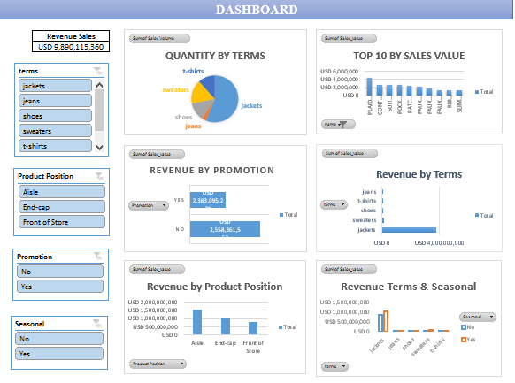

# Zara Sales & Promotion Effectiveness Analysis (Microsoft Excel)

## Ringkasan Proyek
Proyek ini bertujuan untuk mengevaluasi performa penjualan produk Zara berdasarkan kategori (*Terms*), efektivitas promosi (*Promotion*), penempatan produk (*Product Position*), dan faktor musiman (*Seasonal*). Analisis dilakukan pada dataset berisi **253 transaksi** menggunakan **Microsoft Excel**.

---

## Analytical Objectives
- **Analisis Efektivitas Promosi:** Membandingkan kontribusi *revenue* dari produk promo vs non-promo untuk mengukur kekuatan harga normal (*organic demand*).
- **Performa Kategori Produk:** Mengidentifikasi kategori produk yang menjadi penggerak utama (*key driver*) volume penjualan dan pendapatan.
- **Analisis Pengaruh Musiman:** Menilai dampak faktor *seasonal* terhadap fluktuasi penjualan di tiap kategori untuk optimasi alokasi stok di masa depan.

---

## Tools & Metodologi
- **Software:** Microsoft Excel (Pivot Table, Pivot Chart, Dynamic Slicers, Data Formatting).
- **Metodologi:** 
  - **PDCA Framework:** Pendekatan terstruktur dari perencanaan hingga usulan tindakan bisnis.
  - **Feature Engineering:** Pembuatan kolom kalkulasi `Sales Value` (Revenue) dari perkalian `Price` × `Sales Volume`.

---

## Alur Pengerjaan 

### 1. Perencanaan & Formulasi Masalah
- Menentukan tujuan analisis berdasarkan tiga pilar utama: Efektivitas Promosi, Performa Kategori, dan Dampak Musiman.
- Menentukan variabel analisis: Kategori (*Terms*), *Product Position*, *Promotion*, *Seasonal*, *Price*, *Sales Volume*, dan *Sales Value*.

### 2. Pengolahan & Analisis Data
- **Data Cleaning & Transformation:**
  - Menangani *missing values* dan memvalidasi format data pada 253 baris transaksi.
  - Membuat kolom kalkulasi `Sales Value` (`Price` × `Sales Volume`) untuk mengukur total pendapatan (*Revenue*) per transaksi.
- **Exploratory Data Analysis (EDA):**
  - Mengelompokkan data menggunakan **Pivot Table** untuk membandingkan *Revenue* dan *Sales Volume* antarberbagai dimensi.
  - Membangun *Interactive Dashboard* menggunakan **Pivot Chart & Slicers** untuk memvisualisasikan indikator utama.

### 3. Key Insights & Evaluasi
- **Organic Demand:** Produk tanpa promo (*Non-Promo*) menghasilkan *revenue* lebih tinggi (**USD 2,55M**) dibandingkan produk promo (**USD 2,38M**). Hal ini menunjukkan adanya *organic demand* yang kuat, di mana pelanggan tetap membeli meskipun tanpa diskon.
- **Product Leader:** Kategori **Jackets** merupakan penyumbang *revenue* terbesar dan memiliki volume penjualan tertinggi dibandingkan kategori lainnya (*Jeans, Shoes, Sweaters, T-shirts*).
- **Seasonal Stability:** Faktor musiman tidak memberikan perubahan drastis pada sebagian besar kategori, namun tetap menunjukkan pola kenaikan penjualan pada kategori *Jackets* di periode tertentu.

### 4. Rekomendasi Bisnis
- **Optimasi Strategi Diskon:** Mempertahankan harga normal pada produk dengan *organic demand* tinggi (*Jackets*) dan mengevaluasi alokasi anggaran promo agar tidak menggerus margin keuntungan.
- **Manajemen Stok Kategori Utama:** Memprioritaskan ketersediaan stok (*inventory*) pada kategori *Jackets* sebagai pendorong utama pendapatan bisnis.
- **Strategi Alokasi Musiman:** Mempersiapkan peningkatan stok kategori *Jackets* menjelang periode *seasonal* tertentu tanpa harus bergantung pada diskon besar.

---

## Fitur Dashboard Excel
Dashboard interaktif yang dibangun mencakup:
1. **Dynamic Filter (Slicers):** Filter interaktif berdasarkan *Terms*, *Product Position*, *Promotion*, dan *Seasonal*.
2. **Key Metrics (KPI Card):** Total Sales Value / Revenue sebesar **USD 9,890,115,360**.
3. **Interactive Charts** 

---

## 👤 Penulis & Kontak
- **Nama:** Zikra Laela Cahyani
- **LinkedIn:** linkedin.com/in/zikra-laela-cahyani-b42084376
